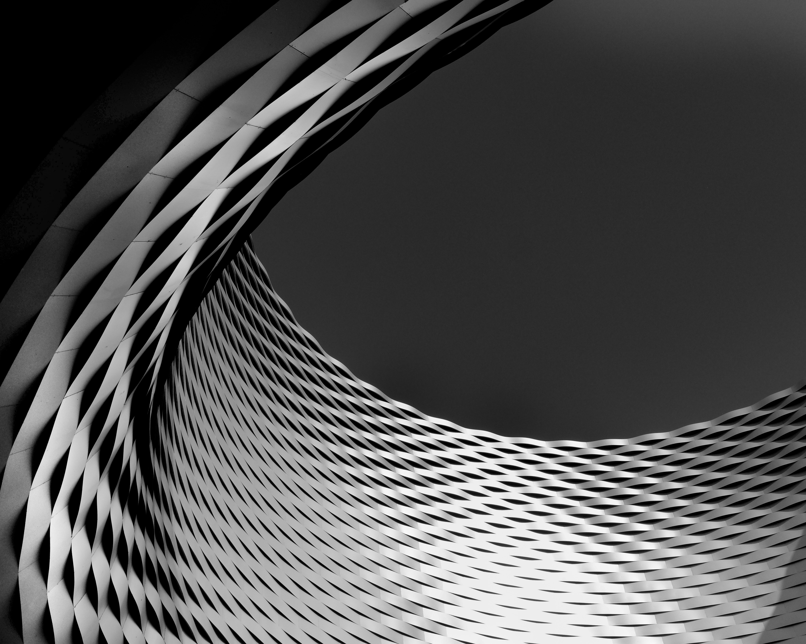

---
title: Got a Chromebook
subTitle: First impressions
category: "Hardware"
cover: stefan-odobasu-1209110-unsplash.jpg
---

My 17" MacBook Pro final gave in after more than ten years of use. Seeing as I had already got a new MacBook last year to act as my main development machine I decided to get myself a Chromebook to diversify my portfolio so to speak.

I headed off to Wirecutter which has always steered me in the right direction when it comes to buying decisions. Based on their recommendation and further research I ended up getting an Asus Chromebook C302CA-DHM4. The specs aren't anything crazy - 12.5" Touchscreen, Intel Core m3, with 64GB storage and 4GB RAM - but in the few days I've been using it it feels nice and snappy. There's also an SD card slot, 2 USB-C ports and a headphone jack so it's pretty well rounded and ready for the future.

I did have one issue when I first got it. It would not turn on but a quick google search gave me the keys to press to do a soft reset and then everything has worked flawlessly ever since. I think the battery gets stuck after being in the box for a long time and maybe the cold didn't help.

So far using a web based OS has been pretty straight forward. I do feel like Google still isn't sure what this is supposed to be as after a few updates the UI changed a lot. There's an awkward duality between Chrome OS and the ability to add Android Apps. I haven't had the chance to explorer this much but will follow up with a post with my thoughts at a later date.

