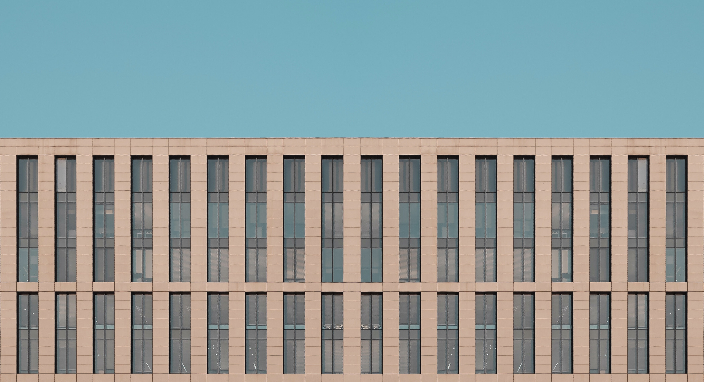

In my previous post about my 2019 goals I outlined a few apps that I'd like to build. These are all ideas I've been floating around and having them as set goals will help me actually complete them.

The first item on my list is a Blog, I've wanted to have one for a while now but never got the time. Now that I've become enamored with Gatsby I will have the opportunity. The idea here is to take an existing [Gatsby starter site](https://github.com/greglobinski/gatsby-starter-personal-blog) and customize it over the year to exactly what I want. 

Seeing as my blog won't be a huge project I have another smaller idea I'd like to build using React and the [React Big Calendar component](https://github.com/intljusticemission/react-big-calendar) - a Holiday Meal Calendar. The idea is pretty simple but all I want is a one page app that shows a calendar that is loaded from say JSON and that gives you an easy way to print a few views - day, week, and month. I'd like to have some rotating banners for local charities, especially the ones that I'm showing on the calendar. The sooner this is built the sooner I can start working to get people on board!

Next up is an app I call To Do Flow - it's a to do list that follows the workflow I'm doing right not with Notes on my phone. What I do is write down the date and then list off all the things that I need to do for that day, then I slowly cross them off as I go. I like to see all everything grouped by date, with the newest at the top, as I find it give me positive reinforcement. I plan to build this using PHP Laravel and Vue for the front end. There's a good To Do List tutorial on the Laravel [website](https://laravel.com/docs/5.1/quickstart)  (and an advanced version with [authentication](https://laravel.com/docs/5.1/quickstart-intermediate#installation))  so I will use that as my starting point an then expand it to my flow. From there I will add on Vue. 

Finally, my last project is Emoji Streak again using Laravel and Vue. The idea comes from an interview I read with Jerry Seinfeld. They asked him what makes him such a good writer and his response was that he wrote every day, to do this he would take a big full year calendar and put a big red X on each day that he wrote - [don't break the chain](https://www.writersstore.com/dont-break-the-chain-jerry-seinfeld/). I want to build the same idea but using emoji to have a little fun with the idea.

